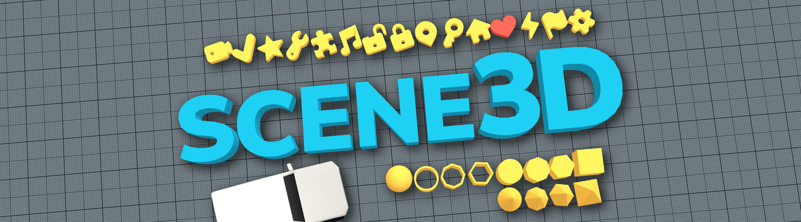

# Scene3D - make 3D games with Defold

Scene3D is a collection of assets to help you developing 3D games with the Defold game engine. Use included prefabs to quickly prototype structures, levels, and to test game mechanics. Try out ideas quickly!

The built-in example scene is available [✨**to play online**✨](https://indiesoftby.github.io/defold-scene3d/). Controls:
- `WASD` to run or drive, `SPACE` to jump. Mouse to look. `4` to switch between character/car.
- Special keys: `5` to reload current scene, `6` to load next scene, `0` to toggle photo mode (move the mouse to look, `WASD` to fly, `SPACE` to go up, `C` to go down, `M` to copy camera settings).
- In the debug build: `1` to toggle physics debug, `2` to toggle profiler.

Follow further developments:
- 💬 [The topic on the Defold forum](https://forum.defold.com/t/scene3d-collection-of-assets-for-3d-gamedev/70352).

## Showcase

## Key features

* [x] Car physics.
* [x] Character controller.
* [x] Controls: keyboard, mouse look with a pointer lock.
* [x] Frustum culling for 3D meshes. **Note: now it's better to use Defold's built-in frustum culling.**
* [x] Helper 3D math functions ([docs](#math3dlua)).

### Included Assets (i.e. Prefabs)

* [x] Camera. Options: clear color, FOV, near clip, far clip.
    * [x] First-person mouse-look with a pointer lock support.
    * [x] Orbit camera script to follow an object in a third-person view.
* [x] Directional Light. Options: ambient color, intensity, light direction, fog color, fog range.
* [x] Chunked Floor. Spawns objects from a factory to make an "infinite" world around an object.
* [x] Late Update. It calls your scripts after all `update` functions have been called and physics objects have been moved.
* [ ] [Request more](https://github.com/indiesoftby/defold-scene3d/issues/new?template=content-request.md) or [contribute](#contributing-to-scene3d).

#### Debugging

* [x] Photo mode: press `0` to capture controls and observe the scene. The mode controls: move the mouse to look, `WASD` to fly, `SPACE` to go up, `C` to go down, `M` to copy camera settings, `Enter` to take a screenshot.

#### Buildings

* [x] Floor: 1x1, 2x2, 5x5, 10x10.
* [x] Walls: 0.1x1x3, 0.1x5x3, 0.1x10x3.
* [x] Blocks: 1x1x1, 3x3x3, 5x5x5.
* [x] Walls with door frames.
* [x] Walls with window frames.
* [x] Stairs 1x1.
* [x] Ramps 1x1, 3x3, 1x2, 3x6.

#### Environment

* [x] Sky: texture mapped on sphere.

#### Icons

* [x] Arrow (right), cog, flag, flash, heart, home, key, location, lock closed/open, music, puzzle, spanner, star, tick, video.
* [x] Letters A-Z, numbers 0-9.

#### Primitives

* [x] Cone.
* [x] Cube.
* [x] Cylinder.
* [x] Pyramid.
* [x] Sphere.
* [x] Tube.

#### Props

* [x] Road cone.
* [x] Soccerball.

#### Visual Effects

* [x] Blob shadows (implemented as projected 2D sprites).

#### Materials

* [x] `basic_color.material` - colors your model + the simplest shading. The mesh should have the "color" stream.
* [x] `basic_grid_*.material` - it puts a texture on your objects without having to make UV’s.
* [x] `basic_unlit.material` - the simplest possible textured material. `sky.material` is the same but with a different tag.
* [x] `primitive_*.material` - no textures, only applies tint on your model.

Some materials have a tint from the palette:  Nickel,  Timberwolf,  Pacific Blue,  Verdigris,  Middle Blue Green,  Medium Champagne,  Maximum Yellow Red,  Atomic Tangerine,  Salmon,  Candy Pink.

Included shaders don't apply [gamma correction](https://learnopengl.com/Advanced-Lighting/Gamma-Correction).

## Current Status

⚠️ **Work in progress** ⚠️

* ✔️ It's suitable for production, but be aware that API, scripts, project structure aren't in a finished state and may be changed.
* ✔️ If you are making the game with Scene3D, follow the optimization section below before releasing your game.

## How To Use

### Before You Start

Scene3D uses the metric system, i.e. metres as its default unit for measuring distance/length, i.e. 1 unit is 1 meter.

* Coordinate system: [OpenGL, i.e. a right-handed system](https://learnopengl.com/Getting-started/Coordinate-Systems) - the positive x-axis is to your right, the positive y-axis is up and the positive z-axis is backwards. The forward direction is `vmath.vector3(0, 0, -1)`.

### Installation

Use it in your own project by adding this project as a [Defold library dependency](http://www.defold.com/manuals/libraries/). Open your `game.project` file and in the dependencies field under project [add the link to **the ZIP file**](https://github.com/indiesoftby/defold-scene3d/archive/refs/heads/main.zip).

#### Required Dependencies

* [Pointer Lock](https://github.com/indiesoftby/defold-pointer-lock) (only if a project uses `mouse_look.script` or the `debug_ui.collection` prefab).

#### Optional Dependencies

Scene3D can use the following dependencies if you include them in your project:

* [Clipboard](https://github.com/britzl/defold-clipboard).
* [Screenshot](https://github.com/britzl/defold-screenshot).

### Included Scenes

* [x] `playground`: a playable level with a first-person character controller and a car. Loaded first.
* [x] `basic_3d`: use it as a template to start developing a new 3D project/scene.
* [x] `shadows`: a scene to test shadows.

### `math3d.lua`

The table briefly describes the included helper math functions. The source code of [`math3d.lua`](scene3d/helpers/math3d.lua) has more detailed explanation.

| Lua Function | Description | Corresponding Unity API |
| ------------ | ----------- | ----------------------- |
| **Quaternions** |
| `math3d.euler_x(q)` | Returns the Euler angle representation of a rotation, in degrees - X. | `Quaternion.eulerAngles.x` |
| `math3d.euler_y(q)` | Returns the Euler angle representation of a rotation, in degrees - Y. | `Quaternion.eulerAngles.y` |
| `math3d.euler_z(q)` | Returns the Euler angle representation of a rotation, in degrees - Z. | `Quaternion.eulerAngles.z` |
| `math3d.quat_inv(q)` | Returns the inverse of rotation. | `Quaternion.Inverse` |
| `math3d.quat_look_rotation(forward, upwards)` | Creates a rotation with the specified forward and upwards directions. | `Quaternion.LookRotation` |
| **Math** |
| `math3d.clamp(x, min, max)` | Clamps the given x between the given minimum float and maximum float values. | `Mathf.Clamp` |
| `math3d.clamp01(x)` | Clamps x between 0 and 1 and returns value. | `Mathf.Clamp` |
| `math3d.delta_angle(a, b)` | Calculates the shortest difference between two given angles (in degrees). | `Mathf.DeltaAngle` |
| `math3d.inverse_lerp(t, a, b)` | Calculates the lerp parameter between of two values. | `Mathf.InverseLerp` |
| `math3d.lerp(t, a, b, [dt])` | Linearly interpolates between `a` and `b` by `t`. The parameter `t` is clamped to the range `[0, 1]`. | `Mathf.Lerp` |
| `math3d.lerp_angle(t, a, b, [dt])` | Same as `vmath.lerp` but makes sure the values interpolate correctly when they wrap around 360 degrees. | `Mathf.LerpAngle` |
| `math3d.limited_lerp(t, a, b, max_step)` | Same as `vmath.lerp` but `max_step` limits the increment of value. | - |
| `math3d.move_towards(a, b, max_delta)` | Moves the `a` value towards `b`. | `Mathf.MoveTowards` |
| `math3d.ping_pong(t, length)` | Pingpongs the value t, so that it is never larger than length and never smaller than 0. | `Mathf.PingPong` |
| `math3d.repeat_(t, length)` | Loops the value t, so that it is never larger than length and never smaller than 0. | `Mathf.Repeat` |
| `math3d.sign(x)` | Returns the sign of x. | `Mathf.Sign` |
| `math3d.smooth_step(x, min, max)` | Interpolates between min and max with smoothing at the limits. | `Mathf.SmoothStep` |
| `math3d.smooth_damp(a, b, cur_velocity, smooth_time, max_speed, dt)` | Gradually changes a value towards a desired goal over time. | `Mathf.SmoothDamp` |
| `math3d.smooth_damp_angle(a, b, cur_velocity, smooth_time, max_speed, dt)` | Gradually changes an angle given in degrees towards a desired goal angle over time. | `Mathf.SmoothDampAngle` |
| **Camera** |
| `render3d.screen_to_world(x, y, z, [world_coord])` | Transforms a point from screen space into world space. | `Camera.ScreenToWorldPoint` |
| **Noise** |
| `scene3d.simplex_noise2(x, y)` | Generates 2D Perlin noise. Output range is [0, 1]. | `Mathf.PerlinNoise` |

## Known Issues

* Frustum culling uses camera matrices from the previous frame.

### Optimization

***TODO***

*... Add information about the over-use of scripts and how to optimize them.*
*... Add info about shaders optimization, downsizing meshes buffers.*

### Vote For The Issues

The following issues are critical for the further development of Scene3D. Please put 👍👍👍 on them!

* [Control sort order of rendered primitives](https://github.com/defold/defold/issues/3625) + [Allow sorting front-to-back](https://github.com/defold/defold/issues/5168).
* [Optimize file size of Buffer](https://github.com/defold/defold/issues/6272) + [Add option for indexed vertices for buffers to be used with the mesh component](https://github.com/defold/defold/issues/5477).
* [More matrix types as shader constants](https://github.com/defold/defold/issues/3789).

#### Editor Issues

* [Render axis Z and horizonal grid in perspective camera mode](https://github.com/defold/defold/issues/6420).
* [Incremental adjustment of properties values](https://github.com/defold/defold/issues/6417).
* [Material constants are not easy to edit](https://github.com/defold/defold/issues/6413).

## Contributing to Scene3D

👍🎉 First off, thanks for taking the time to contribute! 🎉👍

Scene3D tries to follow the principles:

* **Developer-friendly:** it should be user-friendly and have a comfortable learning curve to make it a good choice for developers of any experience.
* **Mobile-friendly:** it should be able to run on mobile and web platforms.
* **Ready-to-use:** the included components should be ready for production.

When creating a bug report, please include as many details as possible. If you find a Closed issue that seems like it is the same thing that you're experiencing, open a new issue and include a link to the original issue in the body of your new one.

Please, follow code formatting style of the project:

* The default indentation is **4 spaces** for the all code, i.e. Lua, C++, HTML/CSS/JS, GLSL. Who prefer to use tabs to indent code, configure [git to automatically switch between spaces and tabs](http://stackoverflow.com/questions/2316677/can-git-automatically-switch-between-spaces-and-tabs/2318063#2318063).
* Use `snake_case` when naming files, Lua variables, objects, functions, and instances.
* This [Lua Style Guide](https://github.com/Olivine-Labs/lua-style-guide) mostly suits the project well.

## Credits

Artsiom Trubchyk ([@aglitchman](https://github.com/aglitchman)) is the current Scene3D owner within Indiesoft and is responsible for the open source repository.

### Contributors

1. Brian Kramer ([@subsoap](https://github.com/subsoap))
2. Be the next!

### License

The content and sources are licensed under [the MIT license](LICENSE.md).

### Third-Party Licenses & Acknowledgements

- The excellent [POLYGON Prototype Pack by Synty](https://syntystore.com/products/polygon-prototype-pack) inspired a collection of prefabs for mechanics & level prototyping.
- 3D icons shapes are based on [Typicons](https://www.s-ings.com/typicons/) by Stephen Hutchings, CC BY-SA 4.0 License.
- [Nunito Sans](https://fonts.google.com/specimen/Nunito+Sans#about) are licensed under the Open Font license.
